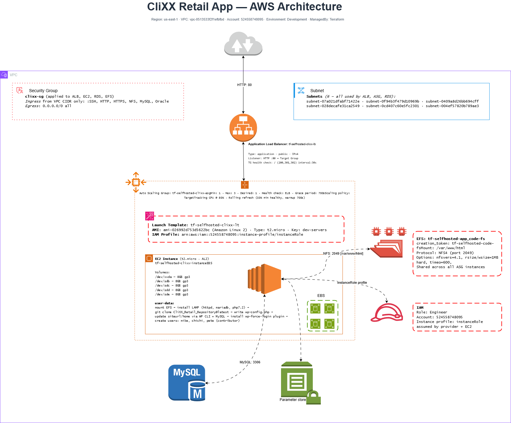

# stack-Clixx

This stack provisions the full runtime for the **CliXX Retail** WordPress application: an Application Load Balancer, an auto-scaling fleet of EC2 instances running on Amazon Linux 2, and the RDS database the app talks to. Each instance is booted with a user-data script that wires up EFS-backed shared storage, an LVM-managed pool of EBS volumes, a LAMP stack, WP-CLI, the `wp-force-login` plugin, and a set of seeded contributor users.

Unlike `stack-Blog`, this stack **owns the database**: RDS is restored in-place from a named snapshot (`clixx-working-snapshot`) every time the stack is applied. The network layer (VPC, subnets, security groups) and the IAM instance profile are still expected to exist beforehand.

---

## Architecture Overview



```
                          Application Load Balancer (public, HTTP:80)
                                          │
                                          ▼
                                  Target Group (HTTP:80, matcher 200/301/302)
                                          │
                          ┌───────────────┼───────────────┐
                          ▼               ▼               ▼
                       EC2 #1          EC2 #2          EC2 #3   ← Auto Scaling Group (1–3)
                          │               │               │       (AL2, t2.micro, launch template + instance refresh)
                          └───────────────┼───────────────┘
                                          ▼
                          /var/www/html ← EFS mount (shared WordPress files)
                          /u01 … /u0N   ← LVM volumes carved from attached EBS disks
                                          │
                                          ▼
                                  RDS (db.m5.large, restored from snapshot)
```

The LB's DNS name, the DB endpoint, the DB user, and the DB password are all written to SSM (`/stack/clixx/*`) after apply so other tooling can discover them. The user-data script itself does **not** read these from SSM at boot — they're baked into the launch template's `user_data` as exported shell variables, sourced from the Terraform resources directly. SSM is only consulted as a fallback if `lb_dns_name` is somehow empty.

All resources follow the naming convention:
`tf-{RUNNER}-{ORGANIZATION}-{purpose}`

---

## Load Balancer (`ec2.tf`)

### Target Group — `tf-{RUNNER}-{ORGANIZATION}-tg`

An HTTP target group on port 80, bound to the VPC passed in via `var.vpc_id`. The ASG registers its instances against this target group; the LB then health-checks and routes traffic through it.

The health-check matcher is **`200,301,302`**. WordPress with `wp-force-login` active will redirect anonymous `GET /` to `/wp-login.php` with a `301`, so a matcher of `200,302` alone causes the LB to mark every instance unhealthy and ping-pong replace them. `301` is the entry that keeps the fleet stable.

### Application Load Balancer — `tf-{RUNNER}-{ORGANIZATION}-lb`

A public-facing ALB (`internal = false`) spanning the subnets passed in via `subnet_ids`. `ip_address_type = "ipv4"` keeps this LB IPv4-only — switch to `dualstack` if IPv6 clients show up.

### Listener

A single HTTP listener on port 80 forwards all incoming traffic to the target group. No TLS termination here — for production add a 443 listener with an ACM certificate and redirect 80 → 443.

---

## Launch Template (`launch-template.tf`)

### Launch Template — `tf-{RUNNER}-{ORGANIZATION}-lt`

The blueprint every instance in the ASG is launched from.

| Setting | Value | Why |
|---|---|---|
| `image_id` | `ami-0123456789abcdef0` | **Amazon Linux 2** — pinned. The user-data uses `amazon-linux-extras` and `yum`, so this AMI family is load-bearing. |
| `instance_type` | `t2.micro` | Burstable. Sufficient for dev; bump up for sustained traffic. |
| `key_name` | `dev-servers` | SSH key pair — for debugging via SSH when needed. |
| `iam_instance_profile` | `arn:aws:iam::222222222222:instance-profile/instanceRole` | Grants permission to read SSM, mount EFS, and reach the RDS endpoint. |
| `network_interfaces.associate_public_ip_address` | `true` | Required so each instance can reach `github.com`, `wp-cli` builds, and AWS APIs during bootstrap. |
| `user_data` | inline heredoc + `file(...)` | Exports DB endpoint, name, user, password, and LB DNS as shell variables, then `cat`s in `scripts/user-data.sh`. |

The instance profile (`instanceRole`) is provisioned outside this stack — it must grant `ssm:GetParameter` on `/stack/clixx/*` and permission to mount the EFS filesystem at `fs-08d17e27035524d6f`.

### Block Device Mappings

The template attaches one root volume and four extra data volumes:

| Device | Size | Type | Purpose |
|---|---|---|---|
| `/dev/xvda` | 8 GiB | gp3 | Root volume (AL2). |
| `/dev/sdb` | 8 GiB | gp3 | Data disk — picked up by the user-data LVM step. |
| `/dev/sdc` | 8 GiB | gp3 | Data disk — picked up by the user-data LVM step. |
| `/dev/sdd` | 8 GiB | gp3 | Data disk — picked up by the user-data LVM step. |
| `/dev/sde` | 8 GiB | gp3 | Data disk — picked up by the user-data LVM step. |

All volumes are `gp3` at 3000 IOPS / 125 MB/s throughput and have `delete_on_termination = true` so they don't outlive the instance. `encrypted = false` today — flip to `true` (and supply a KMS key) before this carries anything sensitive.

The four extra disks are intentionally non-root so the LVM step in user-data can discover them generically (`lsblk` minus the root disk) — adding or removing a disk in this file flows through to the volume group without script edits.

---

## Auto Scaling (`ec2.tf`)

### Auto Scaling Group — `tf-{RUNNER}-{ORGANIZATION}-asg`

| Setting | Value | Why |
|---|---|---|
| `min_size` / `max_size` / `desired_capacity` | `1` / `3` / `1` | Starts with one instance, can scale to three. No scaling policies are attached, so scaling is manual today — adjust `desired_capacity` to grow the fleet. |
| `health_check_type` | `ELB` | Health is determined by the ALB's target group health checks. An instance that's running but failing HTTP gets replaced. |
| `health_check_grace_period` | `700` seconds | Gives the user-data script just under twelve minutes to install packages, mount EFS, partition four disks into LVM, clone the CliXX repo (on first boot only), install WP-CLI, seed users, and start httpd before the LB starts judging health. The full path genuinely needs this on a t2.micro. |
| `force_delete` | `true` | Allows `terraform destroy` to remove the ASG even if instances are still terminating. Convenient for dev — avoid in production. |
| `vpc_zone_identifier` | `var.subnet_ids` | Spreads instances across the same subnets the LB serves, keeping traffic within-AZ where possible. |
| `target_group_arns` | ALB target group | Auto-registration: new instances are added to the LB target group on launch. |
| `instance_refresh` | `Rolling`, `instance_warmup = 700`, `min_healthy_percentage = 50`, `auto_rollback = true` | Any change to the launch template (new AMI, new user-data, new block-device config) triggers a rolling replace. If new instances fail the LB health check, the ASG rolls back to the previous launch template version automatically. |

`depends_on` pins the ASG behind both the SSM parameter for the LB DNS **and** the RDS instance, so an instance never launches before its database exists.

---

## RDS (`rds.tf`)

This is the piece that differs most from `stack-Blog`. The Clixx stack **provisions its own database** by restoring from a named snapshot:

| Resource | Value | Notes |
|---|---|---|
| `data "aws_db_snapshot" "latest_prod_snapshot"` | `clixx-working-snapshot` | Looks up the most-recent snapshot by that identifier. This snapshot must already exist in the account/region; the stack does not create it. |
| `aws_db_subnet_group.clixx` | `clixx-db-subnet-group` over `var.subnet_ids` | Spreads the DB across the same subnets as the ASG. |
| `aws_db_instance.clixx` | `clixx-restored`, `db.m5.large`, `snapshot_identifier = ...`, `publicly_accessible = false`, `multi_az = false`, `skip_final_snapshot = true` | Restored fresh on every apply that recreates this resource. `skip_final_snapshot = true` means a destroy throws away the live DB — fine for dev where the source snapshot is the source of truth, dangerous anywhere else. |

The instance class (`db.m5.large`) and engine come from the snapshot — Terraform inherits them from the source DB. Changing `instance_class` here is fine; trying to change the engine version isn't.

> **Caution:** because `skip_final_snapshot = true` is set, `terraform destroy` (or any change that forces RDS replacement) will delete the running database without keeping a final snapshot. The original `clixx-working-snapshot` is unaffected, so the data isn't truly lost — but any writes made since the last restore *will* be.

---

## SSM Parameters (`parameter.tf`)

This stack publishes four parameters:

| Name | Value | Consumer |
|---|---|---|
| `/stack/clixx/lb_dns` | `aws_lb.tf-lb.dns_name` | The user-data script (as a fallback if `lb_dns_name` env var is empty), plus any external tooling that needs to point DNS at the LB. |
| `/stack/clixx/clixx_db_host` | `aws_db_instance.clixx.endpoint` | External tooling / debugging. |
| `/stack/clixx/dbuser` | `aws_db_instance.clixx.username` | External tooling / debugging. |
| `/stack/clixx/dbpass` | `var.db_password` | External tooling. **Note:** this stores the DB password as a `String` parameter, not `SecureString`. For anything beyond dev, switch this to `SecureString` with a KMS key. |

These are write-only from this stack's perspective — the user-data script reads them only as a fallback for the LB DNS.

---

## User-Data Bootstrap (`scripts/user-data.sh`)

This is the heaviest piece of the stack and where most failure modes show up. The script runs once per instance launch (with `set -euo pipefail`, so any unhandled error aborts the boot) and brings the host from a bare AL2 AMI to a fully configured CliXX node.

Output goes to `/var/log/user-data.log` via `exec >` so the entire run is captured for debugging.

### What it does, in order:

1. **Reads DB and LB config from exported env vars** (`database_endpoint`, `database_name`, `database_user`, `database_pass`, `lb_dns_name`) — these are injected by the launch template's `user_data` heredoc, sourced from the Terraform resources directly. No SSM round-trip on the hot path.
2. **Mounts EFS** at `/var/www/html` via `nfs4`. The mount entry is added to `/etc/fstab` so it persists across reboots. The region is discovered from IMDSv2 (token-based metadata) rather than being hardcoded. The EFS filesystem ID (`fs-08d17e27035524d6f`) is hardcoded in the script — a likely target for parameterization later.
3. **Partitions and mounts attached EBS volumes via LVM** — installs `lvm2`, discovers every non-root disk with `lsblk` (filtering out the disk that backs `/`), creates a single primary partition on each via scripted `fdisk`, runs `pvcreate` over all of them, builds a `stack_vg` volume group, then carves one 5 GiB logical volume per disk (`Lv_u01`, `Lv_u02`, …). Each LV is formatted `ext4` and mounted at `/u01`, `/u02`, … in sequence. Every step is guarded with an "already exists, skipping" check so the script is safe to re-run. UUIDs for each LV are written to `/etc/fstab` for reboot persistence.
4. **Installs the LAMP stack** — uses `amazon-linux-extras install -y lamp-mariadb10.2-php7.2 php7.2` (this is the AL2-specific path; on AL2023 the equivalent is `dnf install -y` directly), plus `httpd`, `mariadb-server`, and PHP extensions WordPress needs (`gd`, `mbstring`, `xml`, `mysqlnd`).
5. **Clones or skips the CliXX repo** — if EFS already has files (because another instance brought them up first), the clone is skipped. This is what makes the fleet horizontally scalable — only the first instance to boot does the clone work; the rest just mount and serve. The repo is `github.com/stackitgit/CliXX_Retail_Repository`.
6. **Generates `wp-config.php`** — copies `wp-config-sample.php` if no config exists yet, then `sed`s the four DB constants (`DB_NAME`, `DB_USER`, `DB_PASSWORD`, `DB_HOST`) with the env-var values.
7. **Enables `.htaccess` overrides** by flipping `AllowOverride None` → `AllowOverride All` inside the `<Directory "/var/www/html">` block of `httpd.conf`. Unlike `stack-Blog` (which uses a line-number-based `sed` targeting the AL2023 default config), this one uses a **range-based `sed`** keyed on the `<Directory>` markers — it's portable across config layouts.
8. **Installs WP-CLI** if it isn't already on `$PATH` (downloaded directly from `raw.githubusercontent.com/wp-cli/builds`).
9. **Reconciles WordPress URLs with the LB DNS** — connects to RDS, reads `siteurl` and `home` from `wp_options`, and if they don't match `http://${lb_dns_name}` (or the SSM fallback), `UPDATE`s them via the `mysql` client. This is what lets the site be served from a fresh LB DNS without manually editing the database after every redeploy.
10. **Fixes ownership and permissions** on `/var/www` — sets ownership to `apache:apache`, directory bits to `2775` (setgid, so new files inherit group), and file bits to `0664`.
11. **Installs the `wp-force-login` plugin** — anonymous users are redirected to `/wp-login.php` before they can see anything. This is the reason the LB's health-check matcher must include `301`.
12. **Seeds default contributor users** — three accounts (`mike`, `chichi`, `pete`) are created via `wp user create` with `--role=contributor --send-email`. Each is guarded by `wp user get` so re-running the script doesn't error on duplicates.
13. **Restarts and enables httpd** so all of the above is live and survives reboots.

### Why this design

EFS is the key to making the ASG actually horizontal. Without shared storage, every instance would clone a fresh copy of the repo and have its own `wp-config.php`, uploads, and plugin state — and a user uploading content on instance A wouldn't see it from instance B. With EFS mounted at `/var/www/html`, all instances serve the same files, so any instance can handle any request.

The "check first, then clone/create/install" pattern throughout the script makes it **idempotent across instance launches and across re-runs on the same instance** — re-applying the launch template doesn't blow away the existing site, the existing volume group, the existing config, or the existing users.

The EBS+LVM step (3) is deliberately **disk-count-agnostic**: it discovers attached non-root disks at runtime rather than referencing them by name. Adding or removing a `block_device_mappings` entry in `launch-template.tf` automatically grows or shrinks the volume group on the next instance launch — no script edit required. The volumes are local to each instance (not shared like EFS), so they're suited for per-host scratch, logs, or caches rather than CliXX content.

The seeded-users step (12) makes the stack idempotent at the *application* layer too: re-applying the stack from scratch (snapshot restore → fresh instances) yields the same set of contributor accounts. This matters because the restored snapshot may or may not contain those users depending on when it was taken.

---

## Variables (`vars.tf`)

| Variable | Default | Notes |
|---|---|---|
| `ACCOUNT_ID` | — | Required. Used to build the `assume_role` ARN in the provider. |
| `ROLE_NAME` | — | Required. The IAM role Terraform assumes in the target account. |
| `AWS_REGION` | `us-east-1` | Where the LB, ASG, RDS, and EC2 instances are created. Must match the region of the referenced VPC, subnets, EFS, and snapshot. |
| `RUNNER` | — | Required. Embedded in every resource name. |
| `ORGANIZATION` | — | Required. Embedded in every resource name. |
| `GIT_REPO` | — | Required. Currently unused inside `.tf` resources but referenced by upstream CI. |
| `vpc_id` | — | Required. Passed straight to the target group. Unlike `stack-Blog`, this is *not* hardcoded — pass it in via `terraform.tfvars`. |
| `subnet_ids` | List of 6 subnet IDs | Used by the ALB, the ASG, and the DB subnet group. Must be in the same VPC as `security_group_ids`. |
| `security_group_ids` | List of 3 SG IDs | Attached to both the ALB and instances. Must allow 80 in from the world (for the LB) and 80 in from the LB SG (for instances). |
| `db_security_group_ids` | List of 2 SG IDs | Attached to the RDS instance. Must allow 3306 in from the instance SG. |
| `db_password` | — | Required. The master password for the restored RDS instance. Also written to `/stack/clixx/dbpass` as a plain `String` — see the SSM section for the caveat. |
| `usage` | `clixx retail application` | Applied as the `Purpose` default tag. |
| `ENVIRONMENT` | `Development` | Applied as the `Environment` default tag. |
| `ManagedBy` | `terraform` | Applied as the `ManagedBy` default tag. |

---
